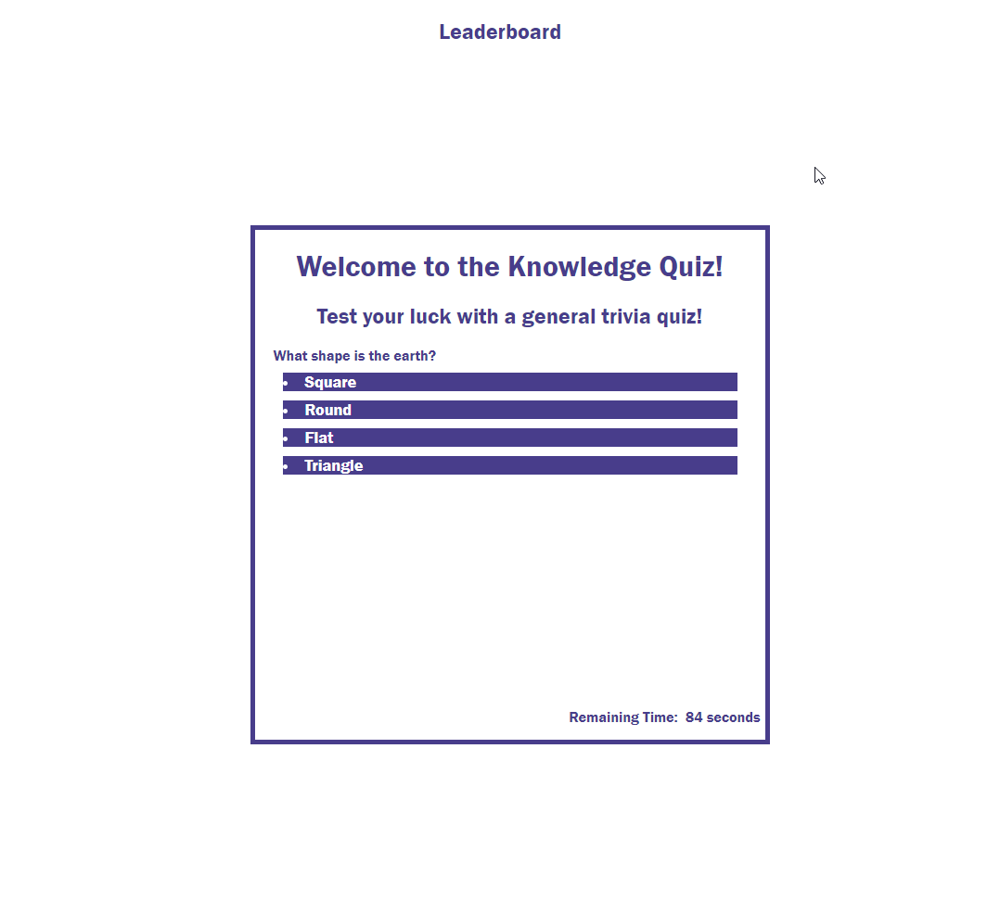

# knowledge-quiz
This is a quiz designed to test your knowledge. Good luck!
## Technology Used 

| JavaScript | [https://developer.mozilla.org/en-US/docs/Web/CSS] (https://developer.mozilla.org/en-US/docs/Glossary/JavaScript)
| JavaScript | [https://www.w3schools.com/java/] (https://www.w3schools.com/js/default.asp)
| JavaScript | [https://www.w3schools.com/js/js_htmldom.asp] (https://www.w3schools.com/js/js_htmldom.asp)
| JavaScript | [https://www.tutorialspoint.com/How-to-reload-the-current-page-without-losing-any-form-data-with-HTML#:~:text=The%20easiest%20way%20to%20reload,your%20web%20browser%20is%20closed.&text=check%20it%20like%20%E2%88%92-,window.,()%20%7B%20var%20name%20%3D%20localStorage.] (https://www.tutorialspoint.com/How-to-reload-the-current-page-without-losing-any-form-data-with-HTML#:~:text=The%20easiest%20way%20to%20reload,your%20web%20browser%20is%20closed.&text=check%20it%20like%20%E2%88%92-,window.,()%20%7B%20var%20name%20%3D%20localStorage.)
| JQuery | [https://www.w3schools.com/jquery/] (https://www.w3schools.com/jquery/)
| JQuery Syntax| [https://www.w3schools.com/jquery/jquery_syntax.asp] (https://www.w3schools.com/jquery/jquery_syntax.asp)
| JQuery Selector| [https://www.w3schools.com/jquery/jquery_selectors.asp] (https://www.w3schools.com/jquery/jquery_selectors.asp)

## Description 

This project was assigned to me to create a general knowledge quiz utilizing JavaScript, JQuery and traversing the DOM using API methods. 

[Visit the Deployed Site](https://mattschneble.github.io/knowledge-quiz/)

## Usage 

This page is to be used to test your general knowledge across a variety of subjects. This quiz has 10 questions and will award you 25 points per correct question, while deducting 15 seconds if an answer is wrong. 

## Learning Points 

Throughout the development of this program I was able to develop my JavaScript, JQuery and API abilities, as well as continuing to work on my HTML and CSS. I was able to utilize different skills such as creating arrays, developing variables using the API methods, appending information to the DOM, and continuing to grow my JavaScript function skills. 

### Matt Schneble

* [LinkedIn](https://www.linkedin.com/in/matthew-schneble/)
* [Github](https://github.com/mattschneble)

## Credits

 I would like to thank Henry Weigand and Kyle Vance for leading pseudocode sessions, as well as some of my classmates (including but not limited to), Thomas Munzar, Sonam Sherpa who asked great questions during the pseudocoding sessions to help increase understanding. All code was entered by myself. I also utilized the sites above to help gain a stronger understanding of concepts and how to use proper syntax, but all code was entered by myself.
